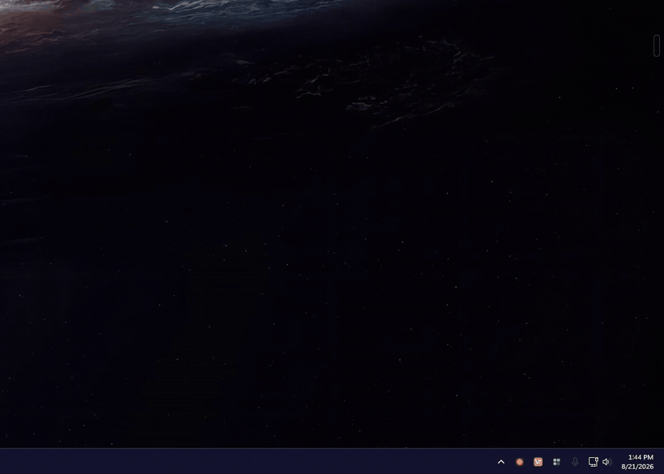

# SpideySense

**Someone walks past your camera. A small live view appears in the corner of your screen,
then quietly disappears.** That is the whole product.

SpideySense is a Windows tray app that watches a [Frigate](https://frigate.video) NVR over
MQTT and pops a borderless, always-on-top window showing the camera that just detected
something - then closes itself. It is not an NVR client, a viewer, or a dashboard. It shows
you a camera for a few seconds and gets out of the way.

[](https://github.com/evankneff/SpideySense/actions/workflows/ci.yml)
[](LICENSE)


[](https://github.com/evankneff/SpideySense/releases/latest)

<p align="center">
  
</p>

<p align="center">
  <em>Summoning a camera from the global-hotkey picker. Detections open the same window on their own.</em>
</p>

> The crate and binary are named `frigate-popup`; SpideySense is the project name.

## Download

Grab the latest build from [Releases](https://github.com/evankneff/SpideySense/releases/latest):

| File | Use when |
|---|---|
| `SpideySense_<version>_x64-setup.exe` | Normal install. Config and logs in `%APPDATA%\frigate-popup\`. |
| `SpideySense_<version>_x64-portable.exe` | Single binary. Drop a `config.toml` beside it to run fully portable. |

Windows x64 only - the focus-suppression path is Win32-specific, so other platforms are out
of scope by design. The binaries are unsigned, so SmartScreen will warn on first launch;
SHA256 checksums are published with every release.

There is no main window. On first run with no config the app writes a commented starter
`config.toml`, tells you where it went, and exits.

## The hard part: never stealing focus

The entire product rests on one requirement - **a popup must never take keyboard focus.**
You are mid-sentence in another window when a delivery driver walks up the driveway. A
window that steals focus does not just annoy you, it eats your keystrokes.

Tauri's `.focused(false)` is **not sufficient** on Windows. A window can still be activated
as it is shown. The real fix applies the Win32 `WS_EX_NOACTIVATE` extended style to the HWND
*before* the window is ever displayed:

```rust
// src-tauri/src/windows.rs - the popup can be shown, but never activated.
let current = GetWindowLongPtrW(hwnd, GWL_EXSTYLE);
SetWindowLongPtrW(hwnd, GWL_EXSTYLE, current | WS_EX_NOACTIVATE.0 as isize);
```

The one deliberate exception is the keyboard camera picker, which the user explicitly
summons and which cannot read arrow keys without focus. It is a **separate window type** so
that exception cannot leak back into detection popups.

## Features

- **Snapshot-first rendering.** Shows a still frame immediately, then swaps to live WebRTC
  once the stream negotiates - because a cold go2rtc stream can take seconds to produce a
  keyframe (see [Field notes](#field-notes)).
- **Lifecycle management.** Cooldowns, minimum display time, auto-close on event end, and
  stacking with eviction when several cameras fire at once.
- **Do-not-disturb**, toggled from the tray, with a distinct paused tray icon.
- **Reload config from the tray** without restarting, for everything that is not already
  bound to a live connection.
- **Global-hotkey camera picker** - keyboard-navigable, opens any camera on demand.
- **Click-through to Frigate** for the full event and recording.
- **No audio at all.** No audio transceiver is negotiated - quiet by construction, not by
  muting.
- **Never lies.** The detection badge is suppressed at the Rust boundary for windows you
  opened by hand. A badge that can be wrong is worse than no badge.

## Design principles

Decision filters, applied in order:

1. **Could this steal focus or interrupt typing?** If yes, redesign it.
2. **Is this glanceable in under two seconds?** If it needs reading, it does not belong in
   a popup.
3. **Does this claim something happened that did not?** Suppress rather than guess.
4. **Is this Frigate's job?** If yes, link out instead of rebuilding it.
5. **Does this add a knob nobody will turn?** Prefer a good default.

## Engineering notes

Written in Rust ([Tauri 2](https://tauri.app)), no frontend build step - the popup page is
vanilla HTML in `src/`.

- **68 unit tests**, `cargo clippy -- -D warnings` clean, verified in CI on Windows.
- **Pure logic is separated from I/O**, so trigger decisions and popup lifecycle are unit
  tested without a broker or a window.
- **Window work is planned under the lock and applied outside it**, so a slow window call
  can never block the MQTT task holding popup state.
- **No `unwrap()` or `expect()` on runtime paths.** Config parsing may fail loudly at
  startup; everything after that degrades rather than panics.
- **A malformed MQTT payload can never kill the client.** It is logged truncated and
  dropped.

### Bugs unit tests did not catch

This project is a standing reminder that passing tests are not evidence a feature works.
Four bugs shipped straight through a green suite and were only found against real hardware:
an overlay script that never ran, popups drawn on top of each other after eviction, a
mislabelled event lifetime, and a shared temp directory that made tests delete each other's
fixtures. Each fix added a regression test for the *mechanism*, not just the output string.

One behaviour is implemented and unit tested but has **never been observed firing against
real hardware**, and is documented as such rather than claimed as working: the `stationary`
close path.

Mid-session MQTT reconnect *has* now been observed in the wild. Every drop so far has been
a sleep/resume transition rather than a broker failure: the connection dies as the machine
suspends, and the first poll after resume returns a timeout, reconnects and resubscribes.
Measured gaps matched the configured backoff to within 80 ms.

## How this project was built

This repository keeps its AI-assisted development scaffolding in the open, because the
process is part of the work:

| Path | Contents |
|---|---|
| `CLAUDE.md` | Standing rules for the AI assistant working in this repo |
| `aiDocs/` | Living context: architecture, PRD, coding style, changelog |
| `ai/roadmaps/` | Phase plans and roadmaps, moved to `complete/` when shipped |

The rule that mattered most is in `CLAUDE.md`: *"Verify before claiming. A passing unit test
is not evidence that a feature works end to end."* The four bugs above are why.

## Layout

```
config.example.toml     commented reference config (compiled into the binary)
assets/gen-icon.js      generates the icon PNGs from scratch, no image deps
src/
  popup.html            the popup page: snapshot-first, WebRTC, header, close button
  picker.html           the keyboard camera picker
src-tauri/
  src/
    main.rs             entry point; no console in release builds
    lib.rs              startup sequence and Tauri app wiring
    cli.rs              argument parsing (--preview, --simulate, --help)
    config.rs           schema, defaults, validation
    paths.rs            config/log locations, portable vs installed
    logging.rs          rotating file logging
    events.rs           Frigate event schema + pure trigger logic (unit tested)
    lifecycle.rs        popup deadlines, stacking, sweep (unit tested)
    mqtt.rs             MQTT client, reconnect/backoff, decision logging
    commands.rs         the three commands the popup page invokes
    tray.rs             tray icon, camera picker, menu
    picker.rs           the global-hotkey camera picker window
    windows.rs          popup creation, placement math, focus suppression
    ui.rs               native message boxes for fatal startup errors
  icons/                app icon + tray icon variants
```

## Config location

Two modes, checked in this order:

1. **Portable** — a `config.toml` next to `frigate-popup.exe`. Logs go to `logs\` beside it.
2. **Installed** — `%APPDATA%\frigate-popup\config.toml`, logs in `%APPDATA%\frigate-popup\logs\`.

Portable mode is opt-in purely by the file existing, so an installed copy never picks up a
stray file from a downloads folder. On first run with no config anywhere, the app writes the
commented starter config, tells you where it went, and exits.

Validation reports **every** problem at once rather than one per run. Unknown keys are
rejected rather than silently ignored, so a typo like `label = [...]` fails loudly instead
of quietly disabling your filter.

## Build and run

```powershell
cd src-tauri
cargo run                  # debug: console attached, logs mirrored to stdout
cargo tauri dev            # same, with Tauri's dev tooling
cargo tauri build          # release NSIS installer in target/release/bundle
cargo test                 # unit tests
cargo clippy --all-targets -- -D warnings
```

Log verbosity is controlled by `RUST_LOG`, e.g. `RUST_LOG=frigate_popup_lib=trace`.

### The binary that runs at boot (2026-08-21)

Launch-at-login runs a **copy** of the release exe, deliberately kept outside `target/`
so `cargo clean` cannot break startup:

```
%LOCALAPPDATA%\frigate-popup\frigate-popup.exe
```

**After any code change, rebuild and re-copy, or boot keeps running the old build:**

```powershell
cd src-tauri
cargo build --release
Copy-Item target\release\frigate-popup.exe "$env:LOCALAPPDATA\frigate-popup\frigate-popup.exe" -Force
```

Registry: `HKCU\SOFTWARE\Microsoft\Windows\CurrentVersion\Run`, value `frigate-popup`.
`tauri-plugin-autostart` writes the path with a trailing space and no quotes, plus a
`StartupApproved\Run` binary entry - the tray tick reads both, so edit it via the tray,
not by hand.

Do not drop a `config.toml` next to that exe - it would flip the app into portable mode
(see `paths.rs`) and silently orphan the real config in `%APPDATA%\frigate-popup\`.

## Field notes

Findings from running this against a live Frigate + go2rtc deployment. Addresses below are
placeholders; substitute your own.

### Frigate camera names are not go2rtc stream names

This is the single most important integration detail, and the reason every `[[cameras]]`
block carries a `name` / `stream` pair rather than one identifier:

| Frigate (`after.camera`) | go2rtc stream |
|---|---|
| `front_door` | `front_door_sub` |
| `garage_camera` | `garage_sub` |

Frigate publishes its own camera name in the MQTT event; go2rtc knows nothing about it. The
config bridges the two. Most streams expose `_main` and `_sub` variants - popups use `_sub`,
since a 480x270 window has no use for a 4K main stream.

Run `cargo run --example discover_cameras` to derive the Frigate names from retained MQTT
topics. This needs no Frigate API auth, which matters because the HTTP API sits behind an
authenticated port.

### WebRTC transport

WebRTC over TCP (port 8555) was blocked on the test network; UDP negotiated fine and played
live video. The player therefore does not assume TCP is available.

### Snapshot cold-start latency

`/api/frame.jpeg` returned in **0.7-3.9 s** for an idle stream but **0.04 s** for an already
active one - go2rtc has to spin up the producer and wait for a keyframe. This is why the
popup fires the snapshot request and the stream connection *in parallel* rather than
treating the snapshot as reliably the fast path.

### Security note: go2rtc exposes camera credentials

`/api/streams` on the go2rtc port is unauthenticated and returns each stream's *resolved*
ffmpeg command line - including camera passwords in plaintext. Anything on the LAN can read
them. Frigate has a published advisory for this class of exposure
([GHSA-mgh5-cr9h-g6hr](https://github.com/blakeblackshear/frigate/security/advisories/GHSA-mgh5-cr9h-g6hr)).

Because the API reports the *resolved* command, moving credentials into environment
variables protects the config file but **does not** close this hole. Treat the go2rtc port as
trusted-LAN-only.

This app never calls `/api/streams`. It needs exactly two go2rtc paths:

| Path | Used for |
|---|---|
| `/api/ws` | WebSocket signalling for WebRTC and MSE |
| `/api/frame.jpeg` | the snapshot-first first frame |

Serving its own player page also avoids go2rtc's bundled `stream.html`, which fetches
`https://go2rtc.org/manifest.json` from the public internet on every load.

## Preview mode

See what a popup actually looks like without waiting for a detection:

```powershell
frigate-popup.exe --preview                      # first `popup.max_popups` enabled cameras
frigate-popup.exe --preview doorbell             # one specific camera
frigate-popup.exe --preview doorbell,garage      # several, stacked in the corner
```

Naming a camera explicitly overrides `enabled = false`, since previewing a camera you have
switched off is how you decide whether to switch it back on.

Preview windows are *live* popups: **no auto-close timer** (quit from the tray or hit ✕ when
you are done), no detection badge, and a blue accent rather than the alert orange. Detection
popups do close themselves — see the lifecycle section.

Placement is computed from the monitor's **work area**, so popups sit above the taskbar
rather than under it. Sizes and offsets in the config are logical pixels and are scaled to
physical pixels at open time, so the popup looks the same on a 100% and a 150% display.

## The popup page

`src/popup.html` is the default (`popup.page = "local"`). Vanilla HTML/JS, no framework,
no build step.

- **Snapshot and stream race each other.** The `frame.jpeg` request and the WebRTC connect
  start at the same instant rather than in sequence — measured here, `frame.jpeg` takes
  0.7–3.9s on a cold stream, so it is not reliably the faster path. Whichever arrives first
  is shown; the video fades over the snapshot once it actually has frames.
- **It speaks go2rtc's signalling directly** over `ws://host:1984/api/ws?src=…`
  (`webrtc/offer` → `webrtc/answer` + `webrtc/candidate`), so it needs neither
  `stream.html` nor `video-rtc.js`. That shrinks the `allow_paths` whitelist to exactly
  `/api/ws` and `/api/frame.jpeg`, and removes the call go2rtc's own page makes to
  `https://go2rtc.org/manifest.json`.
- **Video only** — no audio transceiver is negotiated at all, which keeps the popup quiet
  by construction rather than by muting.
- **Two kinds of popup.** A *detection* popup carries a badge naming what Frigate detected
  and a frozen timestamp meaning "this is when it fired". A *live* popup — from the tray
  picker or `--preview` — is one you opened yourself: **no label badge**, and a clock that
  ticks, since it can sit open for a long time. The badge is suppressed at the Rust
  boundary, not just hidden in CSS, so a hand-opened window cannot claim a detection
  happened. Neither kind draws a coloured border; the only edge is a neutral hairline so a
  bright daytime frame does not bleed into a light desktop.
- Header shows the camera name, the badge (detections only) and the time. A ✕ dismisses it,
  clicking anywhere else opens that camera in the Frigate UI, and hovering pauses the
  auto-close.
- Retries are deliberately quick and few (4 attempts, 400ms × n): there is no point backing
  off to 30s inside a window that closes after 20.

`popup.page = "go2rtc"` switches back to go2rtc's own player, restyled by an injected
stylesheet, if the bundled page ever misbehaves.

## Tray menu

| Item | Behaviour |
|---|---|
| **Show camera ▸** | every configured camera; opens a pinned live view |
| **Pause notifications** | do-not-disturb. The tray icon desaturates and the tooltip changes, because an invisible paused state is one you forget you are in. Not persisted across restarts — deliberately, so you cannot leave yourself silently muted. |
| **Launch at login** | via `tauri-plugin-autostart`. The tick is read from the real registry state on every menu build, so it stays correct if changed outside the app. |
| **Reload config** | re-reads and validates `config.toml`, swaps it in, and rebuilds the menu from it. Cameras, labels, zones, cooldowns and popup geometry apply immediately. Broker and hotkey settings are read but *not* applied - they are already bound to a live connection and an OS registration - so the reload names them and asks for a restart rather than pretending. A config that fails validation leaves the running one untouched. |
| **Open config file / Open log file** | opens the current file in the default handler |
| **Quit** | the only thing that exits the process |

## Keyboard camera picker

Press **F20** (configurable via `[hotkey] binding`) anywhere to open a keyboard-navigable
camera list. Press it again to dismiss.

| Key | Action |
|---|---|
| Up / Down | move the selection, wrapping at both ends |
| Home / End | first / last camera |
| 1-9 | jump straight to that camera and open it |
| Enter | open the selected camera |
| Esc | dismiss |

It opens just above the tray, at the bottom-right of the primary monitor's work area —
the same place a tray context menu appears. Clicking away dismisses it, the way any
launcher does.

Two Windows details make it work. A global hotkey does not count as input to this
process, so `SetForegroundWindow` is refused and the window would appear without focus;
`picker.rs::force_foreground` attaches this thread's input queue to the current
foreground thread for the duration of the call to get around that. And a blur arriving
*before* the window has ever held focus is ignored, because that is the window failing to
activate rather than the user clicking away — honouring it made the picker flash and
vanish.

**This is the only window in the app that takes keyboard focus, deliberately.** It cannot
read arrow keys otherwise. It is a separate window type from the popups (`camera-picker`
rather than `popup-*`) specifically so that exception cannot leak into them — detection
popups still carry `WS_EX_NOACTIVATE` and can never steal focus.

Selecting a camera opens it as a **pinned** live view, the same as the tray picker: no
auto-close, no cooldown, no detection badge.

If the binding is already owned by another application, registration fails, the reason is
logged, and the rest of the app carries on working.

## Tray camera picker

The tray menu lists every configured camera under **Show camera**. Picking one opens that
feed immediately — **pinned**, so it stays until you dismiss it with the ✕. A window you
deliberately asked for should not time out the way a detection alert does, and it bypasses
the cooldown, which exists to stop detections spamming windows rather than to stop you
looking at a camera. Cameras with `enabled = false` are listed too, marked `(alerts off)`,
since asking for a feed by hand is a different intent from wanting alerts from it.

## Popup lifecycle

Activity-driven rather than a fixed duration. All the timing is a pure function of
(opened_at, signal, config, now) in `lifecycle.rs`, so every rule below has a unit test.

| Event | Signal | Effect |
|---|---|---|
| `new` fires the trigger | `Opened` | open the popup, deadline = now + `watchdog_seconds` |
| `update`, object moving | `Active` | deadline = now + `watchdog_seconds` |
| `update`, `stationary: true` | `Stationary` | deadline = now + `linger_seconds` |
| `end` | `Ended` | deadline = now + `linger_seconds` |

Then two clamps, which are what make the rules safe to combine:

- **floor** — never closes before `opened_at + min_display_seconds`
- **ceiling** — never survives past `opened_at + max_display_seconds`
- a linger only ever *pulls the deadline in*, never pushes it out, so a late `end` cannot
  resurrect a popup that was already about to close

```toml
min_display_seconds = 8     # floor, stops it blinking away
linger_seconds      = 15    # grace period after end / going stationary
watchdog_seconds    = 20    # close if no update arrives (covers a dropped `end`)
max_display_seconds = 120   # absolute backstop
```

Note `min_display_seconds` only bites when `linger_seconds` is set below it. With the
defaults an immediate `end` still leaves the popup up for ~15s.

Lifecycle signals are applied **independently of the trigger decision**: only a `new` event
can open a popup, but `update` and `end` still reach an already-open one. An event skipped
for cooldown must still keep its window alive.

A single 500ms sweeper closes expired popups rather than a timer per window — extending a
deadline is then just a field write with no task to cancel, and a machine resuming from
sleep finds everything past its deadline and tidies up in one pass. The sweep plan is
computed under the popup lock and applied outside it, so a window call can never block
while another thread holds that state.

When a popup closes, survivors slide down to close the gap in the corner. At
`max_popups`, a new detection closes the oldest — and the survivors are restacked *before*
the new window opens, or it would land on top of one that never moved.

### Measured on this setup

Real numbers from walk-by detections on 2026-08-20, which is what the defaults are tuned to:

| | |
|---|---|
| `update` gaps while someone is moving | median 196ms, p90 669ms, max ~2.0s |
| gap between the last `update` and `end` | 2.4s – 6.0s |
| observed event lifetimes | 4.0s – 15.4s |
| `stationary: true` | never observed in these walk-bys |

`update` is **not** a fixed heartbeat — Frigate emits on meaningful changes. The ~6s worst
case before `end` is why `watchdog_seconds` needs to stay comfortably above 10s; 20s is the
default for headroom. The stationary path is implemented and unit-tested but has not yet
been exercised against a real motionless person.

## Testing without walking past a camera

Built in, no broker interaction needed:

```powershell
frigate-popup.exe --simulate doorbell          # fake `new` person event at startup
frigate-popup.exe --simulate garage:dog        # any label
```

It runs through the real trigger logic and then carries on connecting to MQTT normally.

Over the wire, to exercise the actual MQTT path:

```bash
mosquitto_pub -h 192.168.1.11 -u frigate_mqtt -P '<pw>' -t frigate/events -m '{
  "type": "new",
  "before": null,
  "after": {
    "id": "1755705123.456789-ab12cd",
    "camera": "doorbell",
    "label": "person",
    "sub_label": null,
    "score": 0.81,
    "top_score": 0.83,
    "false_positive": false,
    "stationary": false,
    "current_zones": [],
    "entered_zones": [],
    "has_clip": false,
    "has_snapshot": false,
    "start_time": 1755705123.456789,
    "end_time": null
  }
}'
```

Frigate can also create a manual event over its API
(`POST /api/events/<camera>/<label>/create`), but on this setup that goes through the
authenticated 8971 endpoint, so the two options above are the practical ones.

## Resilience

- MQTT reconnects with exponential backoff, 1s doubling to a 60s ceiling, reset on connect.
  Observed against real hardware on sleep/resume: reconnect and resubscribe 1.08s after a
  1s backoff and 2.02s after a 2s one.
- Subscription is re-issued on every `ConnAck`, not once at startup — the session is clean,
  so a reconnect would otherwise come back subscribed to nothing. This is also what makes
  sleep/resume work.
- Malformed JSON is logged (truncated to 200 chars) and dropped; it cannot kill the task.
- The cadence map that measures event timing is capped at 256 tracked objects.
- The incoming MQTT packet limit is raised to 1 MB. rumqttc defaults to 10 KB and treats
  anything larger as a **connection** error rather than dropping the one message, which
  presents as an endless reconnect loop. Frigate's retained snapshot JPEGs alone are ~14 KB.
